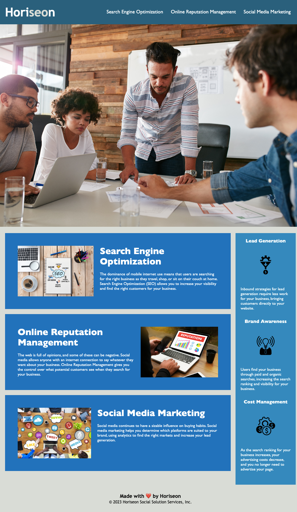

# <Horiseon Social Solution Services Website with Refactored Code>

## Description

A refactored code to follow accessibility standarts better. The webpage is now more optimized for search engines; makes it more accessible, informative and adaptable for users and developer maintenance. We have replaced HTML elements with semantic elements that follow sequential, logical and independent of style structure. Additional alt attributes for images and descriptive title were added as well to assist various accessibility aids. This highlights the importance of web to be available for all. We have to make sure both code and webpage are easy to read, understand, use and interact with.

## Installation

N/A

## Usage

## License

Please refer to the LICENSE in the repo.